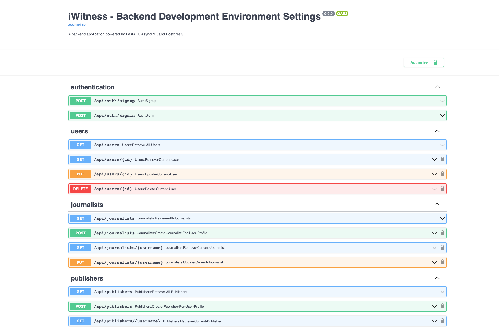
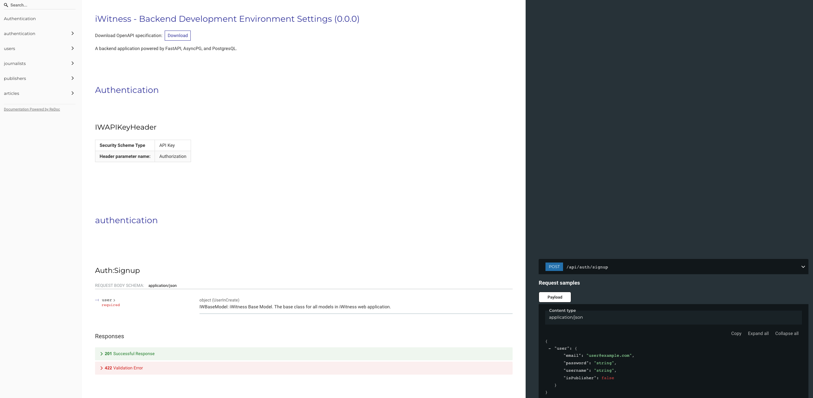
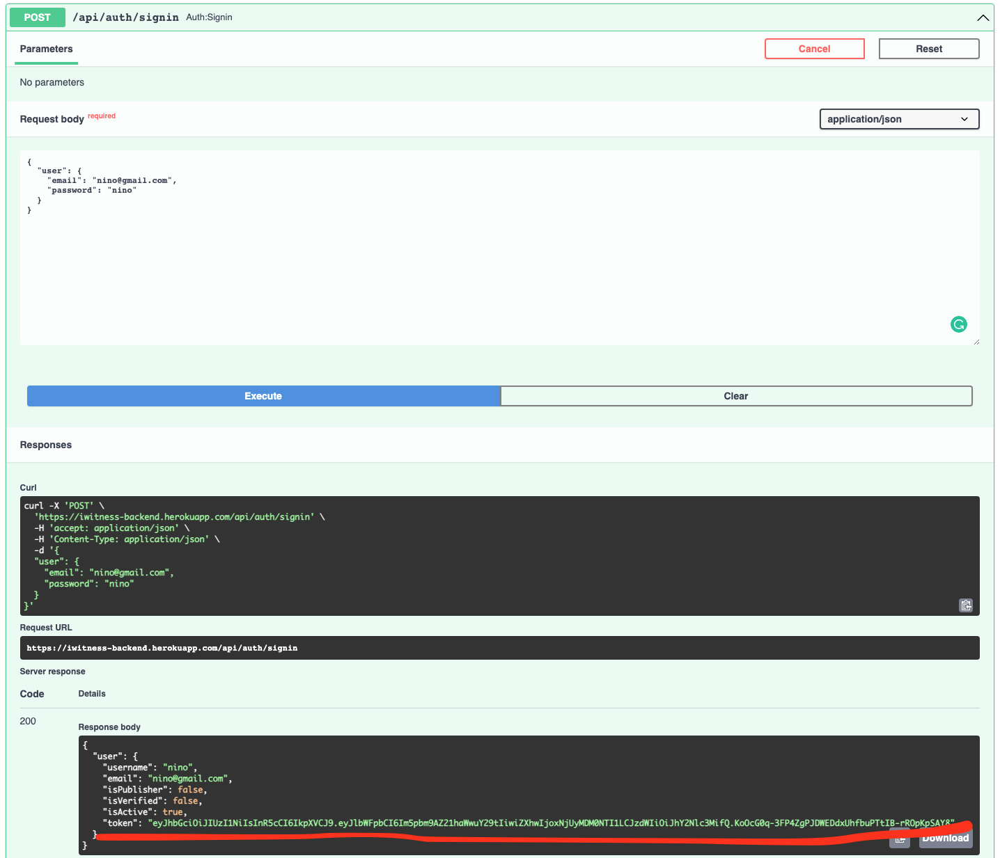
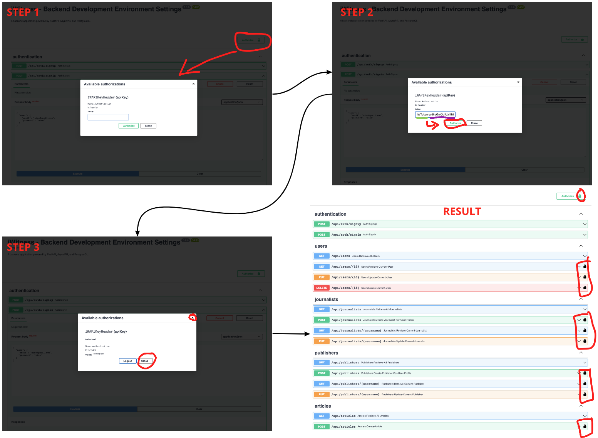

<h1 align=center><strong>iWItness Backend Application</strong></h1>

    

    
    
    
    

# **Official Production Homepage**

1. **Swagger UI: https://iwitness-backend.herokuapp.com/docs**

    

2. **OpenAPI UI: https://iwitness-backend.herokuapp.com/redoc**

    

# **Project Introduction**

**iWitness - Backend Application** is a project that focuses on building the API for **iWitness WEb Application**. This project utilizes the following frameworks and platforms:

1. **Backend Application & API**

- [FastAPI](https://fastapi.tiangolo.com/) - The main framework in building API with the following integrated framework:
  - [OpenAPI](https://www.openapis.org/) - Provides the UI in `http://localhost:8000/redoc`;
  - [Swagger](https://swagger.io/) - Provide the UI for API documentation in `http://localhost:8000/docs`;
- [Pydantic](https://pydantic-docs.helpmanual.io/) - One of the two original framework integrated into FastAPI;
- [Starlette](https://www.starlette.io/) - The second franmework that is integrated into FastAPI;

2. **Backend Server**

- [Uvicorn](https://www.uvicorn.org/) - Local server at `localhost:8000`;
- [Gunicorn](https://gunicorn.org/) - Production server;

3. **Database**

-  [AsyncPG](https://github.com/MagicStack/asyncpg) - The fastest asynchronous database interface for Python "3x faster than psycopg2";
-  [SQLAlchemy](https://www.sqlalchemy.org/) - One of the most comprehensive database framework/interface for Python;

4. **Container**

- [Docker](https://hub.docker.com/) - Probably the most famous containerization platform to bundle and deliver softwares as a package (container);

5. **Hosting**

- [GitHub](https://github.com/Eternal-Engine/the-eye) - A Collaboration platform for hosting a project with version control (Git);
- [Heroku](https://www.heroku.com/deploy-with-docker) - A hosting platform.

# **Setup Guide**

- **Step 1: Download the Source Code**
  - Clone: `git clone git@github.com:Eternal-Engine/the-eye.git`
  - [Fork](https://github.com/Eternal-Engine/the-eye/fork)

- **Step 2: Install Backend Dependencies**

            # Go into `backend` directory from your terminal
            $ cd backend

  - (OPTION 1) PIP Python Package Manager:

            $ pip3 install -r requirements.txt
            $ pip3 install -r requirements-dev.txt
            $ source activate/source/bin

  - (OPTION 2) Poetry Python Package Manager:

            $ poetry install
            $ poetry shell

- **Step 3: Set up `.env` variables in `backend/.env.example` and fill in all the empty value.**

- **Step 4: Set Development Settings**
There are 3 application settings "Production", "Development", and "Staging". For this your local setup, we use development environment:

            # Go to application main file
            $ cd backend/app/main.py

            # Change the `app_env` parameter in line 12 into `EnvTypes.DEV`

- **Step 5: Initialize Docker Container & PostgreSQL Database**
There are 2 Docker images for the backend application in development settings: `db` and `backend`.

  - First, we build the `db` Docker image:

            $ Docker build
            $ Docker up db

  - Secondly, go to your database IDE and create 2 dataabses that matches your `DATABASE_URL` & `DATABASE_TEST_URL`in `.env`:
    - Pay attention to your host and ports!

  - Thirdly, go back to the root directory with `$ cd ..` and spin up the `backend` Docker image with `db`:

            $ docker-compose up -d --build
            $ docker-compose up

- **Step 6: The server is up, go to `http://0.0.0.0:8000/docs`**

## **Alternative Setup Guide**

This guide is for you who don't have Docker isntalled. Let's pick up after the above **Step 4: Set Development Settings**. For this st up guide make sure that you are in `backend` directory all the time.

- **Step 1**: Create the PostgresQL databases for `DATABASE_URL` and `DATABASE_TEST_URL`

- **Step 2**: Run manual migration to create tables (MAKE SURE YOUR VENV IS ON)

            $ alembic upgrade heads

- **Step 3**: Run the server

            # PIP
            $ uvicorn app.main:app --reload

            # Poetry
            $ poetry run uvicorn app.main:app --reload

## **Testing & Linting Guide**

Make sure you stay in `backend` directory and your `venv` is on.

- **Testing**
  - With Docker:

            $ docker-compose exec backend python3 -m pytest --cov="."

  - Without Docker with Poetry

            $ poetry pytest-cov

  - Without Docker with PIP:

            $ pytest-cov

- **Linting**
  - With Docker:

            $ docker-compose exec backend black .
            $ docker-compose exec backend isort .
            $ docker-compose exec backend pylint .
            $ docker-compose exec backend mypy .

  - Without Docker with Poetry:

            $ poetry run black .
            $ poetry run isort .
            $ poetry run pylint .
            $ poetry run mypy .

  - Without Docker with PIP:

            $ black .
            $ isort .
            $ pylint .
            $ mypy .

# **Using The API**

## **JWT Token**

JWToken is implemented and utilized to authenticate users. It is also combines with a **self-written** authorization system through the api key in using `HeaderAPI` class from `FastAPI` for the headers response.

- There are endpoints with a lock symbol on the right side which means that it **needs an authenticated user**.

    

- To get **authenticated**, go to either one of these endpoints and `try out` based on your progress using the  API.

    

    As you can see in the above image, highlighted by a red line, you can now copy the token and paste it in the authentication form (see next point).

- Follow these steps (colored in red):

In `Step 2`, the word `IWTOken`, highlighted with a green underline, is our api key. You can change it to whatever you like in the `.env` for the `JWT_TOKEN_PREFIX` variable. If you are authenticated, all the `locks` (See result) are closed.
