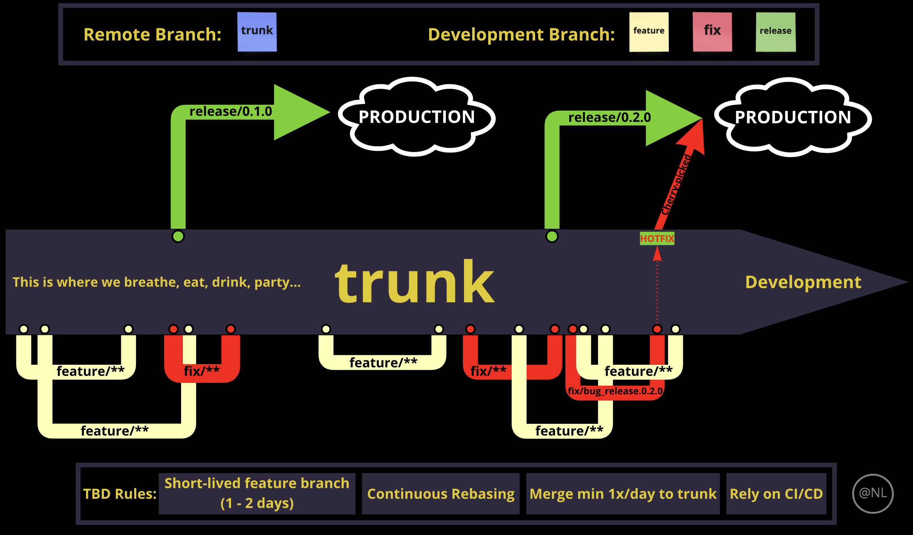

<h1 align=center><strong>Collaboration</strong></h1>

Fig.1.0. Trunk-Based Development Diagram (by <strong>Nino Lindenberg</strong>).

 

# **1. Trunk-Based Development**

## **What is TBD?**

A [Trunk-Based Development](https://trunkbaseddevelopment.com/) is a workflow model where the team collaborates in a single branch called "trunk". There are **3** different variations of TBD:

- ["Committing Straight to the Trunk" - variation](https://trunkbaseddevelopment.com/committing-straight-to-the-trunk/),
- ["Short-Lived Feature Branches" - variation](https://trunkbaseddevelopment.com/short-lived-feature-branches/),
- ["Coupled “Patch Review” System" - variation](https://trunkbaseddevelopment.com/styles/)

**In this project, we are using "Short-Lived Feature Branches" variation of TBD**.

## **Advantages?**

As a small team, we will avoid **merge hell**, **lost in branches**, and **breaking the build** unnecessarily.

 

# **2. Branching Rules**

- There is only 1 active remote (origin) branch; `trunk`.
- Continuous rebase!
- Branching naming conventions:
  
  - Creating new features: `feature/**`.
  - Fixing bugs and issues: `fix/**`.
  - Releasing into production: `release/*.*.*`.

- At least, 1 merge per day.
- Rely heavily on CI and CD for both `backend` and `frontend`.

 

# **3. TBD Workflow**

### **Step 1: Starting Point** 

> git clone git@github.com:Eternal-Engine/the-eye.git
>
> git checkout -b feature/setup_backend_configuration_with_poetry

### **Step 2: After finishing the feature**

> git add poetry.lock pyproject.toml
> 
> git commit -m "feat(backend): Set up backend configuration with Poetry"
>
> git push origin feature/setup_backend_configuration_with_poetry

### **Step 3: General Workflow on Feature and Fix Branches**

> git checkout trunk
>
> git pull --rebase origin trunk
>
> git checkout -b feature/setup_ci_for_backend
>
> \# LOOK AT STEP 2

### **Step 4: Conflict**

If we are still working on `feature 2` (`feature/setup_ci_for_backend`) while another team member just merged his branch `feature 3`, then we need to rebase instantly:

> git checkout trunk
>
> git pull --rebase origin trunk
>
> git checkout feature/setup_ci_for_backend
> 
> git rebase trunk
> 
> git push origin feature/setup_ci_for_backend (end step)

The goal of these steps are

- to keep the `trunk` updated with its `origin/trunk`, and
- to include the most recent merged codes into our working (development) branch.  

### **Step 5: Deployment**

While heavily relying on CI/CD, it is only natural that we also have benefit in automating the deployment process:

> git checkout trunk
> 
> git pull --rebase origin trunk
> 
> git checkout -b release/0.1.0
>
> git push origin release/0.1.0

### **Step 6: Hotfix**

Whenever bugs are found, we first create the `fix/**` branch and solve the bug found in our `release/**`:

> git checkout -b fix/bug_in_production
>
> \# LOOK AT STEP 2

After the branch `fix/bug_in_production` is pushed and merged into `trunk`, we cherry-picked onto our branch `release/**`:

> git checkout release/0.1.0
>
> git cherry-pick -m 1 -x <SHA>
>
> git push origin release/0.1.0

### **Step 7: Tagging**

We can cut a release by adding a tag on the release branch to provide users with a working application including all (new) features:

> git checkout release/0.1.0
>
> git tag -a -m "Releaseing version 0.1.0" 0.1.0
>
> git push origin --tags

 

# **4. Conventional Commits**

## **Why Conventional Commits?**

Conventional commits are applied to have clear communication between team members. This project integrates [Semantic Pull Request](https://probot.github.io/apps/semantic-pull-requests/) from Probot to support us in writing the best possible commit messages.

## **Commit Rules**

### **During Coding Proccess**

- We mainly use `git commit -m "What were you working on"` if none of the changes touches the following list:
  - new features,
  - new tests,
  - fixed bugs,
  - docs-related,
  - CI/CD-related
- Use present tense verb at the beginning of the title message, e.g. `"feat(backend):Set up backend initial configuration with Poetry"`.

### **During Pull-Requests**

- The commit title NEEDS to be re-written into (**the scope is optional**):
  - `feat(scope): WHAT_DID_YOU_ADD`,
  - `fix(scope): WHAT_DID_YOU_FIX`,
  - `test(scope): WHAT_IS_YOUR_TEST`,
  - `docs(scope): WHAT_DID_YOU_WRITE`,
  - `ci(scope): WHAT_DID_YOU_ADD`,

- The body will be used to create check points to summarize all the commits made during the coding process.

### **Breaking Change**

- If something breaks because of the new codes, then:
  - `feat(scope)!: WHAT_DID_YOU_BREAK`,
  - `test(scope)!: WHAT_DID_THE_TEST_BREAK`

 

# **Reseources**

- https://trunkbaseddevelopment.com/styles/
- https://www.atlassian.com/continuous-delivery/continuous-integration/trunk-based-development
- https://cloud.google.com/architecture/devops/devops-tech-trunk-based-development
